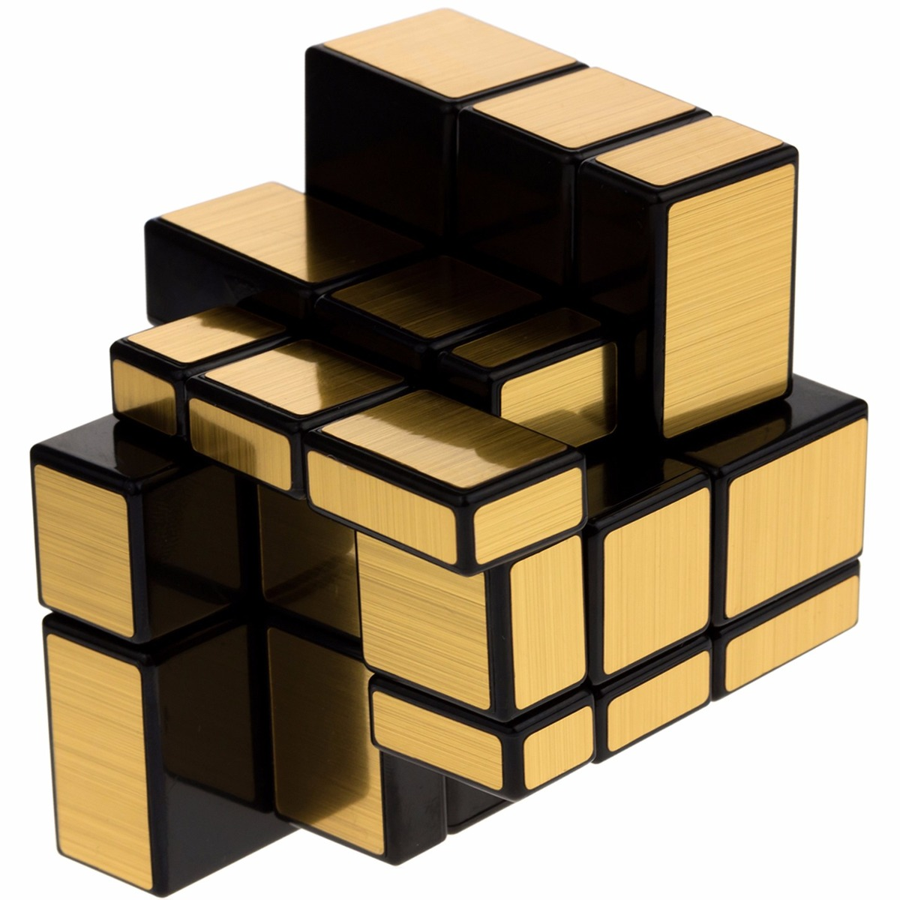

  

  <h3 align="center">Guía Patrones de Diseño</h3>

  

    En la actualidad es una <b>obligacion</b> manejar los patrones de diseño para introducirse de forma 
    avanzada en la programación, por esta razón este proyecto te introducirá a fondo en los <b>patrones 
    GOF (Gang of Four)</b> para que puedas crear tus propias arquitecturas.
  

  

## Tabla de contenidos

* [Tipos de Patrones de Diseño](#tipos-de-patrones-de-diseno)
* [Como instalar el Proyecto](#como-instalar-el-proyecto)
* [Changelog](#changelog)
* [Contribuir al proyecto](#contribuir-al-proyecto)
* [Crees que haz encontrado un bug?](#crees-que-haz-encontrado-un-bug)
* [Codigo de Conducta](#codigo-de-conducta)

## Tipos de Patrones de Diseno

Gof ha estimado 3 tipos, estos son: 

* **Patrones de creación**: utilizados para crear objetos.
* **Patrones estructurales**: su objetivo es desacoplar las interfaces, clases y objetos.
* **Patrones de comportamiento**: se centran en la comunicación de clases y objetos.

## Patrones Creacionales

Si deseas crear objetos puedes basarte en estos: 

### Clases

* **Factory Method**: permite crear objetos dinamicamente, donde retorna el solicitado por parametro. 

### Objetos

* **Abstract Factory**: permite la creacion de factoria dinamicamente, donde se retorna la solicitada por parametro. (capa adicional al patron factory)
* **Builder**: permite crear objetos complejos, donde un orquestador o clase que se encarga de construir el elemento, lo fabrica paso a paso. Ademas, se suele atribuir a este patron la reduccion de complejidad de los 
pojo (clases con get y set, solo tiene el dominio o campos de una seccion del modelo) al annadir metodos estaticos concatenables que retornar la misma instancia para modificar los atributos privados.
* **Prototype**: permite optimizar la creacion de objetos a traves de un proceso de clonacion, solo se requiere implementar la interfaz cloneable y sobreescribir el metodo clone.
* **Singleton**: permite asegurar una unica instancia por objetos, reutilizandolo a lo largo de una aplicacion.

## Patrones Estructurales

### Objetoss

* **Adapter**
* **Bridge**
* **Composite**
* **Decorator**
* **Flyweight**
* **Facade**
* **Proxy**

## Patrones Comportamiento

### Clases

* **Interpreter**
* **Template Method**

### Objetos

* **Chain of Responsability**
* **Command**
* **Iterator**
* **Mediator**
* **Memento**
* **Observer**
* **State**
* **Strategy**
* **Visitor**

## Como instalar el Proyecto

Solo importalo como un proyecto de gradle ( Build Managment System, en pocas palabras maneja las dependencias y tareas de compilacion), para mayor información ver el archivo [SETUP.md](SETUP.md)

## Changelog

Todo cambio es registrado en este archivo [CHANGELOG.md](CHANGELOG.md), utilízalo en tus proyectos, no lo olvides.

## Contribuir al proyecto

Por favor lee [CONTRIBUTING.md](CONTRIBUTING.md) archivo con guias de colaboracion.

## Crees que haz encontrado un bug

Por favor deja constancia en [issues](https://github.com/stephanoapiolaza/dessign-pattern/issues) del repositorio en git
y realizaremos un seguimiento en conjunto.

## Codigo de Conducta

Por favor lee este articulo [Code of Conduct](CODE_OF_CONDUCT.md)
